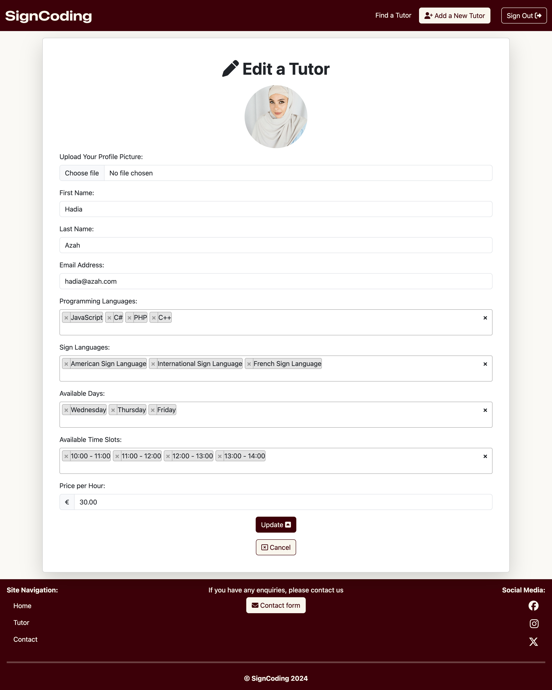

# [SIGNCODING](https://signcoding-d529cc1ebf99.herokuapp.com)

[](https://github.com/RoBizMan/SignCoding/commits/main)
[](https://github.com/RoBizMan/SignCoding/commits/main)
[](https://github.com/RoBizMan/SignCoding)

---

## Introduction

Welcome to SignCoding: Where Programming Meets Sign Language Tutoring! At SignCoding, we bridge the gap between ambition and achievement, providing an inclusive environment tailored to your unique needs. Whether you are starting your coding journey or looking to enhance your skills, our dedicated sign language tutors are here to ensure seamless and effective communication. Join us today and transform your learning experience!

The primary goal of SignCoding is to create an empowering, inclusive platform that connects aspiring programmers with expert sign language tutors. By fostering a supportive learning environment, SignCoding aims to help deaf and hard-of-hearing individuals achieve their full potential in the programming world.


## Target Audience

SignCoding is designed for aspiring programmers and developers who are deaf or hard of hearing. Our platform is perfect for individuals who want to learn programming languages like HTML, CSS, JavaScript, Python, and more in a supportive and inclusive environment. Whether you are a beginner eager to start your coding journey or an experienced coder looking to refine your skills, SignCoding welcomes you to connect, learn, and grow with us.


## Value Proposition

At SignCoding, users can benefit from a streamlined learning experience focused on programming and effective communication. Our verified sign language tutors are experts in programming languages and are here to help you grasp concepts quickly and efficiently. The platform is designed to empower deaf and hard-of-hearing students by providing a curriculum that equips them with the skills needed to thrive in today’s tech landscape.

Join SignCoding today and unlock your potential in a learning environment where programming meets sign language tutoring!


source: [amiresponsive](https://ui.dev/amiresponsive?url=https://signcoding-d529cc1ebf99.herokuapp.com)

---

## UX

In this project, I follow the Five Planes of User Experience model invented by Jesse James Garrett.

### Five Planes of User Experience

This model aids in transforming from abstract ideas, such as creating objectives of the project and identifying the user needs, to concrete concepts, such as assembling visual elements to produce the visual design of the idea to meet the project's objectives and users' needs.

#### The Strategy Plane
The vision for SignCoding is to be a unique, inclusive learning platform where aspiring programmers can connect with expert sign language tutors and seamlessly learn programming languages. Unlike other platforms, SignCoding creates an accessible and empowering environment for deaf and hard-of-hearing students, ensuring effective communication and support throughout their coding journey.

##### Business Goals:
- Community Engagement: Foster a supportive community of aspiring programmers who share their learning experiences and progress. We value your feedback and aim to shape SignCoding based on your needs and preferences.
- Inclusive Learning: Create a dynamic and accessible learning platform enriched by high-quality tutoring services for deaf and hard-of-hearing students.
- Brand Identity: Establish SignCoding as the go-to platform for inclusive programming education, renowned for its intuitive, user-friendly interface and expert sign language tutors.

##### User Needs:
- Aspiring Programmers: A learning platform that provides expert sign language tutors to help them master programming languages like HTML, CSS, JavaScript, Python, and more.
- Deaf and Hard-of-Hearing Students: An inclusive environment where communication is seamless and learning is tailored to their unique needs.
- Skill Seekers: Users who prefer a straightforward and practical learning experience focused on grasping programming concepts without unnecessary complexity.

In this context, the core value of SignCoding lies in providing a streamlined, inclusive learning experience focused on programming education and effective communication through sign language.

#### Scope Plane

Based on the main objective and goals set out in the Strategy Plane, these requirements for developing the website are broken down into two categories:

##### Functional Requirements:
- User Accounts and Profiles: Users should be able to create an account, set up a basic profile, and access tutoring sessions and services.
- Tutoring Sessions: A simple process for users to book and attend sign language tutoring sessions focused on programming languages.
- Tutor Listings: Display a list of tutors with their programming languages, sign languages, day availabilities, and time slot availabilities.
- Booking History: Users should be able to view their booking history and manage their sessions.
- Primary Navigation: Users should be able to navigate between their profile, tutor listings, and booking history.

##### Content Requirements:
- Tutor Profiles: Profiles for tutors showcasing their expertise, available programming and sign languages, and schedule.
- User Profiles: Basic profiles showing the user's booking history and upcoming sessions.

#### The Structure Plane

The requirements outlined in the Scope Plane were then used to create a structure for the website. A site map below shows how users can navigate the website easily.


#### The Skeleton Plane

Please refer to the [Wireframes](#Wireframes) section for more detailed wireframing.

#### The Surface Plane

[Click here to view the live site.](https://signcoding-d529cc1ebf99.herokuapp.com)

### Colour Scheme

I used [Color Hunt](https://colorhunt.co/palette/3c0008f9f6ee000000ffc107#justCreated) to generate my colour palette.


- `#F9F6EE` is used for the primary background, inverted font colour and secondary button.
- `#3C0008` is used for the primary navbar, main button, and footer colour.
- `#FFC107` is used for the secondary button.
- `#000` is used for the main font colour.

The colour palette for SignCoding represents the harmony between coding and sign language education, using vibrant colours to symbolise inclusivity and communication.  However, the colour palette needed to pass the minimum colour contrast set by the Web Content Accessibility Guide (WCAG). The colour palette was tested using [Coolors' Color Contrast Checker](https://coolors.co/contrast-checker/). The result below shows that these colours passed the minimum WCAG contrast ratio.

<details>
<summary>Color Contrast Checker</summary>


</details>

<br>

### Typography

- [Bootstrap's native font stack](https://getbootstrap.com/docs/5.3/content/reboot/#native-font-stack) was used throughout the site.

- [Font Awesome](https://fontawesome.com) icons were used throughout the site, such as the social media icons in the footer and buttons in a detailed gram view.

---

## User Stories

### New Site Users

- As a new site user, I would like to create an account, so that I can access tutoring services.
- As a new site user, I would like to browse available tutors, so that I can find the right match for my learning needs.
- As a new site user, I would like to book a tutoring session, so that I can start learning programming with a sign language tutor.

### Returning Site Users

- As a returning site user, I would like to view my booking history, so that I can keep track of my past sessions.

- As a returning site user, I would like to check tutor profiles' date and time availability, so that I can book new sessions as per my schedule.

- As a returning site user, I would like to update my profile information, so that my details remain current.

### Site Admin

- As a site administrator, I should be able to manage user accounts, so that I can ensure a secure and efficient platform.

- As a site administrator, I should be able to monitor tutor availability, so that I can maintain an up-to-date list of available sessions.

- As a site administrator, I should be able to handle booking requests, so that I can ensure smooth scheduling and session management.

---

## Wireframes

To follow best practice, wireframes were developed for mobile, tablet, and desktop sizes.
I've used [Balsamiq](https://balsamiq.com/wireframes) to design my site wireframes.

### Mobile Wireframes

<details>
<summary> Click here to see the Mobile Wireframes </summary>

Home
  - 

Find a Tutor
  - 

Tutor Profile
  - 

Contact
  - 

</details>

### Tablet Wireframes

<details>
<summary> Click here to see the Tablet Wireframes </summary>

Home
  - 

Find a Tutor
  - 

Tutor Profile
  - 

Contact
  - 

</details>

### Desktop Wireframes

<details>
<summary> Click here to see the Desktop Wireframes </summary>

Home
  - 

Find a Tutor
  - 

Tutor Profile
  - 

Contact
  - 

</details>

---

## Features

### Existing Features

- **The Home Page**
  - The Home Page is the first contact users will encounter when visiting this website. The page appears with the title welcoming users to the website. It details what the website is all about. The button leads users to the Find a Tutor page. Also, if a user scrolls down to the bottom, two buttons lead users either to Register (Sign Up) or Login. Once a user is logged in, these two buttons will be replaced with a single button, "My Profile", that leads users to their profile page. [Click here to view the home page](https://signcoding-d529cc1ebf99.herokuapp.com)


- **Header**
  - At the top of the website is the header, where users can see the company's brand on the left and the fixed navigation menu on the right side, which was made to be fully responsive across different device sizes. In addition, the navigation menu is hidden on a mobile device, and the hamburger icon allows users to open and close the navigation menu. Also, the Add a New Tutor or My Profile link is hidden when a user or superuser is not logged in. The Add a New Tutor link will only appear if the user is a superuser or has admin privilege. Otherwise, the My Profile link will be displayed for users with no admin privilege. The Register and Login buttons will be replaced with the Sign Out button once a user is logged in. These features will return to the original once a user is logged out.


- **Footer**
	The footer is at the bottom of the website, where users can visit the company's social media presence. The site navigation allows users to find the exact page they want quickly. Finally, the Contact Form button lets users contact the website owner quickly. The copyright message is located at the bottom of the website body, and clicking it redirects users to the Home Page.


- **The Alert Message**
  - The alert message appears below the navigation bar to inform a user of their action, such as successfully logging in or logging out and updating their post successfully.


- **Newsletter**
	- The newsletter is located above the Home Page footer, allowing users to sign up for the newsletter to receive future discount offers or the latest news about the website.


- **Find a Tutor**
	- The Find a Tutor consists of five rows of tutors offering their tutoring services through this website. If more than five tutors are on a page, the pagination control will appear. It is a maximum of five tutors per page. Each tutor will consist of their profile picture and full name that slices their surname into one initial to protect their privacy, programming skills, and sign language skills. Also, it shows the tutor's set price per hour with a button to lead users to view the tutor's profile. [Click here to view the Find a Tutor page](https://signcoding-d529cc1ebf99.herokuapp.com/tutors/)


- **Tutor Profile**
	- The tutor profile displays the tutor's full details. The page contains complete programming skills, sign language skills, day availability, and time availability. The Edit or Delete button is hidden for non-superuser/admin users. They will only display if a user has admin privileges or is a superuser. It allows an admin to edit the tutor in the frontend view. An admin can add a new tutor to the website with the Add a New Tutor button in the header.




- **Book a Tutor**
	- The Book a Tutor page fetches the tutor ID from the tutor profile and renders the brief tutor profile at the top to ensure that a user is booking the correct tutor. It also fetches the user's full name. A user can view the tutor's day availability through Flatpickr's datetime picker widget, which displays green as available and red as unavailable (fully booked or less than 24 hours). Once a user selects the date, the session time slots will appear, and a user can choose one or more time slots using Select2. The total amount will be calculated automatically based on the session time slots a user chooses. The Stripe card payment details are included in this form, which handles the error. The Book Session button is disabled upon the page load until a user fills in all forms, and the button becomes clickable. When a user is ready to book the session, the loading screen will display, and the user will proceed to the next page if the payment is successfully processed.


- **Booking Confirmation**
	- The booking confirmation will appear once the payment has been successfully processed and will display all the details a user has booked. It also automatically sends the email to both the user and the tutor.


- **User Profile**
	- A user can view their booking history through their user profile section. Also, a user can update their full name or delete the account.


- **Contact**
	- A user can contact the owner through the contact form. If the contact form is successfully submitted, it will proceed to the contact confirmation with the ticket ID and send it to a user's email address to retain the contact confirmation.


### Future Features

- Customisable themes for users to change the theme to their own preferred style.
- Implement MFA (Multi-Factor Authentication) to secure their accounts from potential security breaches by bad hack players.
- Introduce Notifications to receive a notification about their booking status.
- Enable the search function using the tutor's name.
- Add the review and feedback to the tutor's profile page.
- Add the rating to the tutor's profile list and on the profile page.
- Implement a filtering function to filter tutors by programming or sign languages.
- Add the ability to rebook the same tutor under the booking history in the user profile.
- Implement dark-mode support to reduce eye strains on users.
- Redesign the website to include some intuitive, advanced UI design.

---

## Tools & Technologies Used

- [](https://tim.2bn.dev/markdown-builder) used to generate README and TESTING templates.
- [](https://git-scm.com) used for version control. (`git add`, `git commit`, `git push`)
- [](https://github.com) used for secure online code storage.
- [](https://gitpod.io) used as a cloud-based IDE for development.
- [](https://en.wikipedia.org/wiki/HTML) used for the main site content.
- [](https://en.wikipedia.org/wiki/CSS) used for the main site design and layout.
- [](https://www.javascript.com) used for user interaction on the site.
- [](https://jquery.com) used for user interaction on the site.
- [](https://www.python.org) used as the back-end programming language.
- [](https://www.heroku.com) used for hosting the deployed back-end site.
- [](https://getbootstrap.com) used as the front-end CSS framework for modern responsiveness and pre-built components.
- [](https://www.djangoproject.com) used as the Python framework for the site.
- [](https://dbs.ci-dbs.net) used as the Postgres database from Code Institute.
- [](https://cloudinary.com) used for online static file storage.
- [](https://whitenoise.readthedocs.io) used for serving static files with Heroku.
- [](https://stripe.com) used for online secure payments of ecommerce products/services.
- [](https://mail.google.com) used for sending emails in my application.
- [](https://balsamiq.com/wireframes) used for creating wireframes.
- [](https://fontawesome.com) used for the icons.
- [](https://chat.openai.com) used to help debug, troubleshoot, and explain things.
- [](https://www.perplexity.ai) used to help explain things, troubleshoot, and debug.
- [](https://codepen.io) used for toying and testing with CSS design before committing changes to the actual website design.

---

## Database Design

Entity Relationship Diagrams (ERD) help to visualise database architecture before creating models.
Understanding the relationships between different tables can save time later in the project.

##### Tutor

```python
class ProgrammingLanguage(models.Model):
	
    name = models.CharField(max_length=50, unique=True)
    def __str__(self):
        return self.name
```

```python
class SignLanguage(models.Model):
    name = models.CharField(max_length=50, unique=True)

    def __str__(self):
        return self.name
```

```python
class DayAvailability(models.Model):
    name = models.CharField(max_length=20, unique=True)
    order = models.PositiveIntegerField(default=0)

    def __str__(self):
        return self.name

    class Meta:
        ordering = ['order']
        verbose_name = "Day Availability"
        verbose_name_plural = "Day Availabilities"
```

```python
class TimeSlot(models.Model):
    start_time = models.TimeField()
    end_time = models.TimeField()

    def __str__(self):
        return f"{self.start_time.strftime('%H:%M')} - {self.end_time.strftime('%H:%M')}"

    def clean(self):
        if self.start_time >= self.end_time:
            raise ValidationError("Start time must be before end time.")
        if self.end_time <= self.start_time:
            raise ValidationError("End time must be after start time.")
```

```python
class Tutor(models.Model):
    tutor_firstname = models.CharField(max_length=50, verbose_name="Tutor's First Name")
    tutor_lastname = models.CharField(max_length=50, verbose_name="Tutor's Surname")
    tutor_email = models.EmailField(max_length=254, unique=True, verbose_name="Tutor's Email Address", validators=[EmailValidator()])
    programming_languages = models.ManyToManyField(ProgrammingLanguage, related_name="tutors")
    sign_languages = models.ManyToManyField(SignLanguage, related_name="tutors")
    day_availability = models.ManyToManyField(DayAvailability)
    time_availability = models.ManyToManyField(TimeSlot, related_name="tutors")
    price = models.DecimalField(max_digits=6, decimal_places=2)
    photo = CloudinaryField('profile_picture', default='images/default_tutor.jpg')

    def __str__(self):
        return f"{self.tutor_firstname} {self.tutor_lastname} | {self.tutor_email}"

    def get_full_name(self):
        return f"{self.tutor_firstname} {self.tutor_lastname}"
```

##### Personal User
```python
class Profile(models.Model):
    personal_details = models.OneToOneField(User, on_delete=models.CASCADE, verbose_name="Username")
    personal_firstname = models.CharField(max_length=50, blank=True, null=True, verbose_name="User's First Name")
    personal_lastname = models.CharField(max_length=50, blank=True, null=True, verbose_name="User's Last Name")

    def __str__(self):
        return self.personal_details.username

    def get_full_name(self):
        return f"{self.personal_firstname} {self.personal_lastname}"
```

```python
@receiver(post_save, sender=User)
def create_or_update_user_profile(sender, instance, created, **kwargs):
    if created:
        Profile.objects.create(
            personal_details=instance,
            personal_firstname=instance.first_name,
            personal_lastname=instance.last_name
        )
    else:
        profile = Profile.objects.get(personal_details=instance)
        profile.personal_firstname = instance.first_name
        profile.personal_lastname = instance.last_name
        profile.save()
```

##### Booking
```python
class Booking(models.Model):
    PAYMENT_STATUS_CHOICES = [
        ('pending', 'Pending'),
        ('paid', 'Paid'),
        ('failed', 'Failed'),
    ]

    booking_id = models.CharField(max_length=32, unique=True, editable=False, verbose_name="Booking ID")
    booking_date = models.DateTimeField(auto_now_add=True, editable=False, verbose_name="Booking Date")
    stripe_pid = models.CharField(max_length=254, unique=True, null=False, blank=False, default='', editable=False, verbose_name="Stripe Payment ID")
    user = models.ForeignKey(Profile, on_delete=models.SET_NULL, related_name="bookings", null=True)
    user_fullname = models.CharField(max_length=101, null=True, blank=False, verbose_name="User's Full Name")
    user_email = models.CharField(max_length=254, null=True, blank=False, verbose_name="User's Email address")
    tutor = models.ForeignKey(Tutor, on_delete=models.SET_NULL, related_name="bookings", null=True)
    tutor_fullname = models.CharField(max_length=101, null=True, blank=False, verbose_name="Tutor's Full Name")
    tutor_email = models.CharField(max_length=254, null=True, blank=False, verbose_name="Tutor's Email address")
    total_price = models.DecimalField(max_digits=6, decimal_places=2)
    session_date = models.DateField()
    session_time = models.ManyToManyField(TimeSlot, related_name="bookings")
    payment_status = models.CharField(max_length=10, choices=PAYMENT_STATUS_CHOICES, default='pending')

    class Meta:
        ordering = ['-booking_date']

    def _generate_booking_id(self):
        return uuid.uuid4().hex.upper()

    def save(self, *args, **kwargs):
        if not self.booking_id:
            self.booking_id = self._generate_booking_id()

        if not self.stripe_pid:
            self.stripe_pid = self._generate_stripe_pid()

        super().save(*args, **kwargs)

    def __str__(self):
        return f"Booking Number {self.booking_id}"

    def is_available(tutor, session_date, time_slot):
        bookings = Booking.objects.filter(
            tutor=tutor,
            session_date=session_date,
            session_time=time_slot
        )
        return not bookings.exists()
```

##### Newsletter

```python
class NewsletterSubscription(models.Model):
    email = models.EmailField(unique=True)

    def __str__(self):
        return self.email
```

##### Contact

```python
class Contact(models.Model):
    ticket_id = models.UUIDField(default=uuid.uuid4, editable=False, unique=True)
    date_submitted = models.DateTimeField(auto_now_add=True)
    full_name = models.CharField(max_length=255)
    email = models.EmailField()
    message = models.TextField()

    def __str__(self):
        return f"Ticket {self.ticket_id} - {self.full_name}"
```

I have used `pygraphviz` and `django-extensions` to auto-generate an ERD.

The steps taken were as follows:
- In the terminal: `sudo apt update`
- then: `sudo apt-get install python3-dev graphviz libgraphviz-dev pkg-config`
- then type `Y` to proceed
- then: `pip3 install django-extensions pygraphviz`
- in my `settings.py` file, I added the following to my `INSTALLED_APPS`:
```python
INSTALLED_APPS = [
    ...
    'django_extensions',
    ...
]
```
- back in the terminal: `python3 manage.py graph_models -a -o erd.png`
- dragged the new `erd.png` file into my `documentation/` folder
- removed `'django_extensions',` from my `INSTALLED_APPS`
- finally, in the terminal: `pip3 uninstall django-extensions pygraphviz -y`


source: [medium.com](https://medium.com/@yathomasi1/1-using-django-extensions-to-visualize-the-database-diagram-in-django-application-c5fa7e710e16)

I have used `Mermaid` to generate an interactive ERD of my project.


source: [Mermaid](https://mermaid.live/edit#pako:eNqVVE1v2zAM_SuGzunQIG0D-Latx2EYkJ2GAAZjM44QWTIkaquX5r-PspzEX8swXWyTj0_k05NPIjcFilSgfZVQWqi2OuH1yZij1GVyip9hObIhsouZTBa3VAGEJCu8JkNgUhkeNWZ1v7JLeYc223ulNFQ4n8UKpJqkyJO5UxnTo9ICc1mBSsgQqKy2MsfhKIlD56TRozHyA9ikhqZCTZkjIO9i8hwf36zZS4UzmtVondG82V5aR7OdXiEK-oiO-rPRBDn1qb2XRUIyPyLNn0V4yZzfVZIIp5IHzbJhK61OyUgtwjdKKhYEymFPX_GXU8jcduN3LuezJdas3-KE7yZUcFrFbXwBXXpmnhFtIsJGlvp_8K_QfPzJe8NOKknN3ZKwpCYs0SbGFmgHTN9Zz40yA_1bjdkFlrLwOkqgLnrhC01w40wbnYn_6o2YHxrjpu9dj4_czTHWrj4YMtfOhhf-_f3hwZyuXk6TrQjXbytmYXGiAGq7GKPOJqIu8gXg5W616oi-MB16zh2hsL7FWYuYcLMMA6O0e3LgHzVjs4SyApoMesHZwsFwYahJiViICi2fT8H_2fb0GXjAMH7cxR4D7Mw4YOZNo3ORkvW4EL4Ot7j7M4t0D8pxtAYt0pN4E-njQjQiXS7XH57WL6vV0_L55flxuVqfF-K3MVyxbNE_2vdIaY0vDx3V-Q9ES-9O)

---

## Agile Development Process

### GitHub Projects

[GitHub Projects](https://github.com/RoBizMan/SignCoding/projects) served as an Agile tool for this project.
It isn't a specialised tool, but with the right tags and project creation/issue assignments, it can work.

Through it, user stories, issues, and milestone tasks were planned and tracked weekly using the basic Kanban board.


### GitHub Issues

[GitHub Issues](https://github.com/RoBizMan/SignCoding/issues) served as another Agile tool.
I used my own **User Story Template** to manage user stories there.

It also helped with milestone iterations weekly.

- [Open Issues](https://github.com/RoBizMan/SignCoding/issues) [](https://github.com/RoBizMan/SignCoding/issues)

    

- [Closed Issues](https://github.com/RoBizMan/SignCoding/issues?q=is%3Aissue+is%3Aclosed) [](https://github.com/RoBizMan/SignCoding/issues?q=is%3Aissue+is%3Aclosed)

    

### MoSCoW Prioritization

I've decomposed my Epics into stories before prioritising and implementing them.
Using this approach, I could apply the [MoSCow prioritisation](https://github.com/users/RoBizMan/projects/6/views/2) and labels to my user stories within the Issues tab.

- **Must Have**: guaranteed to be delivered (*max 60% of stories*)
- **Should Have**: adds significant value, but not vital (*the rest ~20% of stories*)
- **Could Have**: has small impact if left out (*20% of stories*)
- **Won't Have**: not a priority for this iteration


Furthermore, based on MoSCoW prioritisation, I calculated the story points based on the [Estimation Matrix](https://www.7pace.com/wp-content/uploads/2022/08/01_Image_Estimation-Matrix-1-scaled.jpg) to score each MoSCoW prioritisation based on my knowledge and skills and the requirements of the project.


Finally, I assigned each MoSCoW prioritisation into one of four sprint weeks.


## E-commerce Business Model

SignCoding operates on a B2C (Business to Customer) model, offering an innovative platform that combines programming education with sign language tutoring. By focusing on empowering deaf and hard-of-hearing individuals, SignCoding creates a direct connection between expert tutors and students, ensuring seamless, individualised learning experiences.

This business model prioritises one-on-one tutoring sessions without requiring long-term subscriptions. Students can book sessions tailored to their specific goals, enabling flexibility and accessibility in their educational journey.

Although developing, SignCoding has implemented features like a newsletter and social media integration to foster community engagement. Social media platforms such as Facebook and Instagram help increase visibility and create a sense of belonging among users. The newsletter serves as a channel to provide updates, such as new tutors joining the platform, special offers, new programming courses, and community events.

By combining these features with its unique value proposition, SignCoding is building a dynamic and inclusive ecosystem to support aspiring programmers in achieving their goals.

## Search Engine Optimization (SEO) & Social Media Marketing

### Keywords

I've identified some appropriate keywords to align with my site, which should help users find my page easily from a search engine when searching online.
This included a series of the following keyword types

- Short-tail (head terms) keywords
- Long-tail keywords

I also played around with [Word Tracker](https://www.wordtracker.com) a bit to check the frequency of some of my site's primary keywords (only until the free trial expired).

### Sitemap

I've used [XML-Sitemaps](https://www.xml-sitemaps.com) to generate a sitemap.xml file.
This was generated using my deployed site URL: https://signcoding-d529cc1ebf99.herokuapp.com

After crawling the entire site, it created a
[sitemap.xml](sitemap.xml), which I've downloaded and included in the repository.

### Robots

I've created the [robots.txt](robots.txt) file at the root-level.
Inside, I've included the default settings:

```
User-agent: *
Disallow:
Sitemap: https://signcoding-d529cc1ebf99.herokuapp.com/sitemap.xml
```

Further links for future implementation:
- [Google search console](https://search.google.com/search-console)
- [Creating and submitting a sitemap](https://developers.google.com/search/docs/advanced/sitemaps/build-sitemap)
- [Managing your sitemaps and using sitemaps reports](https://support.google.com/webmasters/answer/7451001)
- [Testing the robots.txt file](https://support.google.com/webmasters/answer/6062598)

### Social Media Marketing

Creating a strong social base (with participation) and linking that to the business site can help drive sales.
Using more popular providers with a wider user base, such as Facebook, typically maximises site views.

I've created a mockup Facebook business account:


### Newsletter Marketing

I have incorporated a newsletter sign-up form on my application to allow users to supply their email addresses if they want to learn more right above the footer section.

- **Internal newsletter (Django)**


- **Sign Up message success**


- **Sign Up email confirmation**


- **Django admin newsletter subscription control**


---

## Testing

> [!NOTE]  
> For all testing, please refer to the [TESTING.md](TESTING.md) file.

## Deployment

The live deployed application can be found deployed on [Heroku](https://signcoding-d529cc1ebf99.herokuapp.com).

### PostgreSQL Database

This project uses a [Code Institute PostgreSQL Database](https://dbs.ci-dbs.net).

To obtain my own Postgres Database from Code Institute, I followed these steps:

- Signed-in to the CI LMS using my email address.
- An email was sent to me with my new Postgres Database.

> [!CAUTION]  
> - PostgreSQL databases by Code Institute are only available to CI Students.
> - You must acquire your own PostgreSQL database through some other method
> if you plan to clone/fork this repository.
> - Code Institute students are allowed a maximum of 8 databases.
> - Databases are subject to deletion after 18 months.

### Cloudinary API

This project uses the [Cloudinary API](https://cloudinary.com) to store media assets online, due to the fact that Heroku doesn't persist this type of data.

To obtain your own Cloudinary API key, create an account and log in.

- For *Primary interest*, you can choose *Programmable Media for image and video API*.
- Optional: *edit your assigned cloud name to something more memorable*.
- On your Cloudinary Dashboard, you can copy your **API Environment Variable**.
- Be sure to remove the `CLOUDINARY_URL=` as part of the API **value**; this is the **key**.

### Stripe API

This project uses [Stripe](https://stripe.com) to handle the ecommerce payments.

Once you've created a Stripe account and logged-in, follow these series of steps to get your project connected.

- From your Stripe dashboard, click to expand the "Get your test API keys".
- You'll have two keys here:
	- `STRIPE_PUBLIC_KEY` = Publishable Key (starts with **pk**)
	- `STRIPE_SECRET_KEY` = Secret Key (starts with **sk**)

As a backup, in case users prematurely close the purchase-order page during payment, we can include Stripe Webhooks.

- From your Stripe dashboard, click **Developers**, and select **Webhooks**.
- From there, click **Add Endpoint**.
	- `https://signcoding-d529cc1ebf99.herokuapp.com/checkout/wh/`
- Click **receive all events**.
- Click **Add Endpoint** to complete the process.
- You'll have a new key here:
	- `STRIPE_WH_SECRET` = Signing Secret (Wehbook) Key (starts with **wh**)

### Gmail API

This project uses [Gmail](https://mail.google.com) to handle sending emails to users for account verification and purchase order confirmations.

Once you've created a Gmail (Google) account and logged-in, follow these series of steps to get your project connected.

- Click on the **Account Settings** (cog icon) in the top-right corner of Gmail.
- Click on the **Accounts and Import** tab.
- Within the section called "Change account settings", click on the link for **Other Google Account settings**.
- From this new page, select **Security** on the left.
- Select **2-Step Verification** to turn it on. (verify your password and account)
- Once verified, select **Turn On** for 2FA.
- Navigate back to the **Security** page, and you'll see a new option called **App passwords**.
- This might prompt you once again to confirm your password and account.
- Select **Mail** for the app type.
- Select **Other (Custom name)** for the device type.
	- Any custom name, such as "Django" or SignCoding
- You'll be provided with a 16-character password (API key).
	- Save this somewhere locally, as you cannot access this key again later!
	- `EMAIL_HOST_PASS` = user's 16-character API key
	- `EMAIL_HOST_USER` = user's own personal Gmail email address

### Heroku Deployment

This project uses [Heroku](https://www.heroku.com), a platform as a service (PaaS) that enables developers to build, run, and operate applications entirely in the cloud.

Deployment steps are as follows, after account setup:

- Select **New** in the top-right corner of your Heroku Dashboard, and select **Create new app** from the dropdown menu.
- Your app name must be unique, and then choose a region closest to you (EU or USA), and finally, select **Create App**.
- From the new app **Settings**, click **Reveal Config Vars**, and set your environment variables.

> [!IMPORTANT]  
> This is a sample only; you would replace the values with your own if cloning/forking my repository.

| Key | Value |
| --- | --- |
| `CLOUDINARY_URL` | user's own value |
| `DATABASE_URL` | user's own value |
| `DISABLE_COLLECTSTATIC` | 1 (*this is temporary, and can be removed for the final deployment*) |
| `EMAIL_HOST_PASS` | user's own value |
| `EMAIL_HOST_USER` | user's own value |
| `SECRET_KEY` | user's own value |
| `STRIPE_PUBLIC_KEY` | user's own value |
| `STRIPE_SECRET_KEY` | user's own value |
| `STRIPE_WH_SECRET` | user's own value |

Heroku needs three additional files in order to deploy properly.

- requirements.txt
- Procfile
- runtime.txt

You can install this project's **requirements** (where applicable) using:

- `pip3 install -r requirements.txt`

If you have your own packages that have been installed, then the requirements file needs updated using:

- `pip3 freeze --local > requirements.txt`

The **Procfile** can be created with the following command:

- `echo web: gunicorn app_name.wsgi > Procfile`
- *replace **app_name** with the name of your primary Django app name; the folder where settings.py is located*

The **runtime.txt** file needs to know which Python version you're using:
1. type: `python3 --version` in the terminal.
2. in the **runtime.txt** file, add your Python version:
	- `python-3.9.19`

For Heroku deployment, follow these steps to connect your own GitHub repository to the newly created app:

Either:

- Select **Automatic Deployment** from the Heroku app.

Or:

- In the Terminal/CLI, connect to Heroku using this command: `heroku login -i`
- Set the remote for Heroku: `heroku git:remote -a app_name` (replace *app_name* with your app name)
- After performing the standard Git `add`, `commit`, and `push` to GitHub, you can now type:
	- `git push heroku main`

The project should now be connected and deployed to Heroku!

### Local Deployment

This project can be cloned or forked in order to make a local copy on your own system.

For either method, you will need to install any applicable packages found within the *requirements.txt* file.

- `pip3 install -r requirements.txt`.

You will need to create a new file called `env.py` at the root-level,
and include the same environment variables listed above from the Heroku deployment steps.

> [!IMPORTANT]  
> This is a sample only; you would replace the values with your own if cloning/forking my repository.

Sample `env.py` file:

```python
import os

os.environ.setdefault("CLOUDINARY_URL", "user's own value")
os.environ.setdefault("DATABASE_URL", "user's own value")
os.environ.setdefault("EMAIL_HOST_PASS", "user's own value")
os.environ.setdefault("EMAIL_HOST_USER", "user's own value")
os.environ.setdefault("SECRET_KEY", "user's own value")
os.environ.setdefault("STRIPE_PUBLIC_KEY", "user's own value")
os.environ.setdefault("STRIPE_SECRET_KEY", "user's own value")
os.environ.setdefault("STRIPE_WH_SECRET", "user's own value")

# local environment only (do not include these in production/deployment!)
os.environ.setdefault("DEBUG", "True")
```

Once the project is cloned or forked, in order to run it locally, you'll need to follow these steps:

- Start the Django app: `python3 manage.py runserver`
- Stop the app once it's loaded: `CTRL+C` or `⌘+C` (Mac)
- Make any necessary migrations: `python3 manage.py makemigrations`
- Migrate the data to the database: `python3 manage.py migrate`
- Create a superuser: `python3 manage.py createsuperuser`
- Load fixtures (if applicable): `python3 manage.py loaddata file-name.json` (repeat for each file)
- Everything should be ready now, so run the Django app again: `python3 manage.py runserver`

If you'd like to backup your database models, use the following command for each model you'd like to create a fixture for:

- `python3 manage.py dumpdata your-model > your-model.json`
- *repeat this action for each model you wish to backup*

#### Cloning

You can clone the repository by following these steps:

1. Go to the [GitHub repository](https://github.com/RoBizMan/SignCoding) 
2. Locate the Code button above the list of files and click it 
3. Select if you prefer to clone using HTTPS, SSH, or GitHub CLI and click the copy button to copy the URL to your clipboard
4. Open Git Bash or Terminal
5. Change the current working directory to the one where you want the cloned directory
6. In your IDE Terminal, type the following command to clone my repository:
	- `git clone https://github.com/RoBizMan/SignCoding.git`
7. Press Enter to create your local clone.

Alternatively, if using Gitpod, you can click below to create your own workspace using this repository.

[](https://gitpod.io/#https://github.com/RoBizMan/SignCoding)

Please note that in order to directly open the project in Gitpod, you need to have the browser extension installed.
A tutorial on how to do that can be found [here](https://www.gitpod.io/docs/configure/user-settings/browser-extension).

#### Forking

By forking the GitHub Repository, we make a copy of the original repository on our GitHub account to view and/or make changes without affecting the original owner's repository.
You can fork this repository by using the following steps:

1. Log in to GitHub and locate the [GitHub Repository](https://github.com/RoBizMan/SignCoding)
2. At the top of the Repository (not top of page) just above the "Settings" Button on the menu, locate the "Fork" Button.
3. Once clicked, you should now have a copy of the original repository in your own GitHub account!

### Local VS Deployment

No difference between local and deployment was noticed.

---

## Credits

### Content

| Source | Location | Notes |
| --- | --- | --- |
| [Markdown Builder](https://tim.2bn.dev/markdown-builder) | README and TESTING | tool to help generate the Markdown files |
| [Chris Beams](https://chris.beams.io/posts/git-commit) | version control | "How to Write a Git Commit Message" |
| [W3Schools](https://www.w3schools.com/howto/howto_js_topnav_responsive.asp) | entire site | responsive HTML/CSS/JS navbar |
| [W3Schools](https://www.w3schools.com/howto/howto_css_modals.asp) | contact page | interactive pop-up (modal) |
| [W3Schools](https://www.w3schools.com/css/css3_variables.asp) | entire site | how to use CSS :root variables |
| [Flexbox Froggy](https://flexboxfroggy.com/) | entire site | modern responsive layouts |
| [Grid Garden](https://cssgridgarden.com) | entire site | modern responsive layouts |
| [strftime](https://strftime.org) | CRUD functionality | helpful tool to format date/time from string |
| [WhiteNoise](http://whitenoise.evans.io) | entire site | hosting static files on Heroku temporarily |
| [W3Schools](https://www.w3schools.com/howto/howto_js_topnav_responsive.asp) | entire site | responsive HTML/CSS/JS navbar |
| [W3Schools](https://www.w3schools.com/howto/howto_css_modals.asp) | detailed gram page | interactive pop-up (modal) to confirm the deletion of the gram |
| [freeCodeCamp](https://www.freecodecamp.org/news/how-to-write-better-git-commit-messages/) | version control | "How to Write Better Git Commit Messages - A Step-By-Step Guide" |
| [W3Schools](https://www.w3schools.com/cssref/css3_pr_box-shadow.php) | entire site | box shadow property |
| [Logo](https://logo.com/) | entire site | the company's logo was generated by Logo and used throughout the website, including favicon |
| [Aurélien Delogu](https://medium.com/@aurelien.delogu/401-error-on-a-webmanifest-file-cb9e3678b9f3) | entire site | "How to solve a 401 error on a webmanifest file" |
| [GitHub Issues](https://github.com/cloudinary/cloudinary-react/issues/70) | entire site | "Mixed Content warning when serving over HTTPS" |
| [Cloudinary Support](https://support.cloudinary.com/hc/en-us/articles/202520362-Can-Cloudinary-s-imaged-be-served-via-SSL-HTTPS) | entire site | Debugging the issue with mixed content warning over HTTPS |
| [Cloudinary Community](https://community.cloudinary.com/discussion/272/anyone-know-why-the-image-not-rendering-in-the-page) | entire site | Debugging the issue with mixed content warning over HTTPS |
| [StackOverflow](https://stackoverflow.com/questions/48508750/how-to-force-https-in-a-django-project-using-cloudinary) | entire site | Force Cloudinary images to load HTTPS instead of HTTP |
| [Code Institute Slack](https://code-institute-room.slack.com/archives/C026PTF46F5/p1706622757171679) | entire site | The solution to the mixed content warning over HTTPS issue |
| [DBDiagram](https://dbdiagram.io/d/PP4-669944b18b4bb5230eb9dc0c) | entire site | The ERD tool to design models for the project's database |
| [Stackoverflow](https://stackoverflow.com/questions/52519142/show-hide-options-in-django-app-to-users-based-on-permission) | entire site | Show/hide pages based on user authentication |
| [Coderbook](https://coderbook.com/@marcus/how-to-restrict-access-with-django-permissions/) | entire site | Restrict non-logged in users from access to login required pages |
| [Django Andy](https://djangoandy.com/2021/06/04/redirecting-an-already-logged-in-user-in-django-using-class-based-views/) | entire site | Redirecting an already logged in user to different pages |
| [Code Institute Slack](https://code-institute-room.slack.com/archives/C066RBQ5TUN/p1722085473266889?thread_ts=1722074962.420909&cid=C066RBQ5TUN) | backend only | Automatic switch between debug true and false |
| [LambdaTest](https://www.lambdatest.com/jest) | Backend only - JavaScript | JavaScript unit testing using Jest guide |
| [Real Python](https://realpython.com/testing-in-django-part-1-best-practices-and-examples/) | Backend only - Python | Testing in Django best practices and examples |
| [django](https://docs.djangoproject.com/en/5.1/topics/testing/overview/) | Backend only - Python | django documentation writing and running tests |
| [Alice Ridgway](https://alicecampkin.medium.com/django-testing-for-beginners-146bd285a178) | Backend only - Python | Django Testing for Beginners |
| [mermaid.live](https://www.mermaidchart.com/) | README.md ERD diagram | Live ERD diagram for markdown |
| [flatpickr](https://flatpickr.js.org/examples/) | Booking page | Flatpickr datetime picker |
| [Select2](https://select2.org/) | Booking and Tutor pages | Multi-choice select boxes in the dropdown menu |
| [Stripe Web Elements](https://docs.stripe.com/payments/elements) | Booking page | Stripe card payment element |
| [Stripe Testing](https://docs.stripe.com/testing) | Booking page | Stripe testing cards |
| [Steemit](https://steemit.com/utopian-io/@riyo.s94/how-to-use-flatpickr) | Booking page | Setting up Flatpickr in the project |
| [YouTube](https://www.youtube.com/watch?v=h7KpTZaYM34) | Booking page | How to initialise the datetime picker in the project |
| [StackOverflow](https://stackoverflow.com/questions/58806996/how-to-grab-selected-dates-from-flatpickr) | Booking page | How to grab selected dates from Flatpickr |
| [Code Institute Slack](https://code-institute-room.slack.com/archives/D06767956V9/p1731571074499459) | Sign Up page | Save user's first and last name in the database through the Sign Up page form |
| [YouTube](https://www.youtube.com/watch?v=8VYx-cNF1lU&t=6s) | Booking and Tutor pages | Django Select2 Tutorial |
| [Webwizard](https://www.webwizard.ie/blog/how-to-create-a-checkbox-inside-a-dropdown-django/) | Booking and Tutor pages | How to Create a Checkbox Inside a Dropdown Django |
| [Anjanesh Consulting](https://anjanesh.dev/sending-post-data-to-a-django-view-via-ajax-to-a-rest-endpoint) | Booking page | Use JavaScript's fetch to connect to a Django REST API URL via AJAX |
| [Django](https://forum.djangoproject.com/t/django-endpoint-to-accept-string-boolean-and-list/24366) | Booking page | Django Endpoint to accept string, boolean, and list |
| [Reddit](https://www.reddit.com/r/djangolearning/comments/nd119y/is_there_a_way_to_add_django_url_in_ajax/?rdt=37578) | Booking page | Is there a way to add Django URL in AJAX? |
| [educative](https://www.educative.io/answers/how-to-work-with-ajax-requests-and-responses-in-django) | Booking page | How to work with AJAX requests and responses in Django |
| [JustDjango](https://justdjango.com/blog/django-stripe-payments-tutorial) | Booking page | Django and Stripe Payments Tutorial |
| [AI Saas Template](https://aisaastemplate.com/blog/django-stripe-integration/) | Booking page | Integrating Stripe with Django: A Comprehensive Guide |
| [TestDriven.io](https://testdriven.io/blog/django-stripe-tutorial/) | Booking page | Django Stripe Tutorial |
| [Episyche](https://episyche.com/blog/how-to-integrate-stripe-payment-gateway-in-django-and-react-for-the-checkout-use-case) | Booking page | How to integrate Stripe Payment Gateway in Django and React for the checkout use case? |
| [Rudrastyh](https://rudrastyh.com/woocommerce/stripe-payment-intents-tutorial.html) | Booking page | Setup Stripe Payments on your Website with Payment Intents |
| [Dev.to](https://dev.to/stripe/fundamentals-of-the-paymentintents-and-paymentmethods-apis-3646) | Booking page | Fundamentals of the PaymentIntents and PaymentMethods APIs |
| [Fireship.io](https://fireship.io/lessons/stripe-payment-intents-tutorial/) | Booking page | Stripe Payment Basics |
| [StackOverflow](https://stackoverflow.com/questions/69429949/how-to-use-stripe-payment-intent-data-to-send-email-to-client-after-succesful-pa) | Booking page | How to use Stripe payment_intent_data to send email to client after successful payment? |
| [StackOverflow](https://stackoverflow.com/questions/78395904/how-customer-gets-an-email-receipt-from-stripe-after-successful-paymentintent) | Booking page | How customer gets an email receipt from Stripe after successful paymentIntent |
| [Scaler](https://www.scaler.com/topics/hamburger-menu/) | the entire site | How to Create a Hamburger Menu in CSS? |
| [YouTube](https://www.youtube.com/watch?v=aNDqzlAKmZc&t=203s) | the entire site | Build a Hamburger Menu with HTML, CSS, and JavaScript |
| [MailTrap](https://mailtrap.io/blog/send-emails-with-gmail-api/) | Contact page/Newsletter app | Send Emails with Gmail API |
| [Endgrate](https://endgrate.com/blog/using-the-gmail-api-to-send-messages-(with-php-examples)) | Contact page/Newsletter app | Using the Gmail API to Send Messages (with PHP examples) |


### Media

| Source | Location | Type | Notes |
| --- | --- | --- | --- |
| [Pexels](https://www.pexels.com) | Tutor pages | image | profile pictures |
| [Pinterest](https://www.pinterest.com/pin/my-saves--583990276699470972/) | Tutor pages | image | default profile picture placeholder |
| [iStock](https://www.istockphoto.com/pl/search/2/image-film?phrase=sign+language+at+work) | Home page | image | students and study groups |

### Acknowledgements

- I would like to thank my Code Institute mentor, [Tim Nelson](https://github.com/TravelTimN), for their support and feedback throughout the development of this project.
- I would like to thank the [Code Institute](https://codeinstitute.net) tutor team for their visual guidance and clarifications throughout all concepts I might not have initially understood.
I would like to thank the [Code Institute Slack community](https://code-institute-room.slack.com) for their moral support. They kept me going during self-doubt and imposter syndrome and kept me sane.
- I would like to thank my partner, Sumit, for believing in me and encouraging me to transition into software development.
- I would like to thank my parents and grandparents for trusting that I could smoothly transition into a new career pathway.