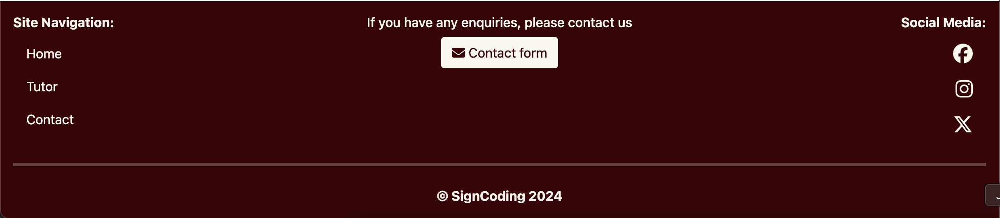
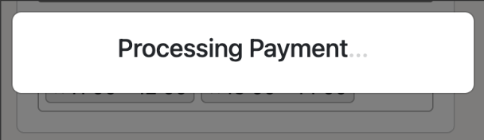

# [SIGNCODING](https://signcoding-d529cc1ebf99.herokuapp.com)

[](https://github.com/RoBizMan/SignCoding/commits/main)
[](https://github.com/RoBizMan/SignCoding/commits/main)
[](https://github.com/RoBizMan/SignCoding)

---

## Introduction

Welcome to SignCoding: Where Programming Meets Sign Language Tutoring! At SignCoding, we bridge the gap between ambition and achievement, providing an inclusive environment tailored to your unique needs. Whether you are starting your coding journey or looking to enhance your skills, our dedicated sign language tutors are here to ensure seamless and effective communication. Join us today and transform your learning experience!

The primary goal of SignCoding is to create an empowering, inclusive platform that connects aspiring programmers with expert sign language tutors. By fostering a supportive learning environment, SignCoding aims to help deaf and hard-of-hearing individuals achieve their full potential in the programming world.


## Target Audience

SignCoding is designed for aspiring programmers and developers who are deaf or hard of hearing. Our platform is perfect for individuals who want to learn programming languages like HTML, CSS, JavaScript, Python, and more in a supportive and inclusive environment. Whether you are a beginner eager to start your coding journey or an experienced coder looking to refine your skills, SignCoding welcomes you to connect, learn, and grow with us.


## Value Proposition

At SignCoding, users can benefit from a streamlined learning experience focused on programming and effective communication. Our verified sign language tutors are experts in programming languages and are here to help you grasp concepts quickly and efficiently. The platform is designed to empower deaf and hard-of-hearing students by providing a curriculum that equips them with the skills needed to thrive in today’s tech landscape.

Join SignCoding today and unlock your potential in a learning environment where programming meets sign language tutoring!


source: [amiresponsive](https://ui.dev/amiresponsive?url=https://signcoding-d529cc1ebf99.herokuapp.com)

---

## UX

In this project, I follow the Five Planes of User Experience model invented by Jesse James Garrett.

### Five Planes of User Experience

This model aids in transforming from abstract ideas, such as creating objectives of the project and identifying the user needs, to concrete concepts, such as assembling visual elements to produce the visual design of the idea to meet the project's objectives and users' needs.

#### The Strategy Plane
The vision for SignCoding is to be a unique, inclusive learning platform where aspiring programmers can connect with expert sign language tutors and seamlessly learn programming languages. Unlike other platforms, SignCoding creates an accessible and empowering environment for deaf and hard-of-hearing students, ensuring effective communication and support throughout their coding journey.

##### Business Goals:
- Community Engagement: Foster a supportive community of aspiring programmers who share their learning experiences and progress. We value your feedback and aim to shape SignCoding based on your needs and preferences.
- Inclusive Learning: Create a dynamic and accessible learning platform enriched by high-quality tutoring services for deaf and hard-of-hearing students.
- Brand Identity: Establish SignCoding as the go-to platform for inclusive programming education, renowned for its intuitive, user-friendly interface and expert sign language tutors.

##### User Needs:
- Aspiring Programmers: A learning platform that provides expert sign language tutors to help them master programming languages like HTML, CSS, JavaScript, Python, and more.
- Deaf and Hard-of-Hearing Students: An inclusive environment where communication is seamless and learning is tailored to their unique needs.
- Skill Seekers: Users who prefer a straightforward and practical learning experience focused on grasping programming concepts without unnecessary complexity.

In this context, the core value of SignCoding lies in providing a streamlined, inclusive learning experience focused on programming education and effective communication through sign language.

#### Scope Plane

Based on the main objective and goals set out in the Strategy Plane, these requirements for developing the website are broken down into two categories:

##### Functional Requirements:
- User Accounts and Profiles: Users should be able to create an account, set up a basic profile, and access tutoring sessions and services.
- Tutoring Sessions: A simple process for users to book and attend sign language tutoring sessions focused on programming languages.
- Tutor Listings: Display a list of tutors with their programming languages, sign languages, day availabilities, and time slot availabilities.
- Booking History: Users should be able to view their booking history and manage their sessions.
- Primary Navigation: Users should be able to navigate between their profile, tutor listings, and booking history.

##### Content Requirements:
- Tutor Profiles: Profiles for tutors showcasing their expertise, available programming and sign languages, and schedule.
- User Profiles: Basic profiles showing the user's booking history and upcoming sessions.

#### The Structure Plane

The requirements outlined in the Scope Plane were then used to create a structure for the website. A site map below shows how users can navigate the website easily.


#### The Skeleton Plane

Please refer to the [Wireframes](#Wireframes) section for more detailed wireframing.

#### The Surface Plane

[Click here to view the live site.](https://signcoding-d529cc1ebf99.herokuapp.com)

### Colour Scheme

I used [Color Hunt](https://colorhunt.co/palette/3c0008f9f6ee000000ffc107#justCreated) to generate my colour palette.


- `#F9F6EE` is used for the primary background, inverted font colour and secondary button.
- `#3C0008` is used for the primary navbar, main button, and footer colour.
- `#FFC107` is used for the secondary button.
- `#000` is used for the main font colour.

The colour palette for SignCoding represents the harmony between coding and sign language education, using vibrant colours to symbolise inclusivity and communication.  However, the colour palette needed to pass the minimum colour contrast set by the Web Content Accessibility Guide (WCAG). The colour palette was tested using [Coolors' Color Contrast Checker](https://coolors.co/contrast-checker/). The result below shows that these colours passed the minimum WCAG contrast ratio.

<details>
<summary>Color Contrast Checker</summary>


</details>

<br>

### Typography

- [Bootstrap's native font stack](https://getbootstrap.com/docs/5.3/content/reboot/#native-font-stack) was used throughout the site.

- [Font Awesome](https://fontawesome.com) icons were used throughout the site, such as the social media icons in the footer and buttons in a detailed gram view.

---

## User Stories

### New Site Users

- As a new site user, I would like to create an account, so that I can access tutoring services.
- As a new site user, I would like to browse available tutors, so that I can find the right match for my learning needs.
- As a new site user, I would like to book a tutoring session, so that I can start learning programming with a sign language tutor.

### Returning Site Users

- As a returning site user, I would like to view my booking history, so that I can keep track of my past sessions.

- As a returning site user, I would like to check tutor profiles' date and time availability, so that I can book new sessions as per my schedule.

- As a returning site user, I would like to update my profile information, so that my details remain current.

### Site Admin

- As a site administrator, I should be able to manage user accounts, so that I can ensure a secure and efficient platform.

- As a site administrator, I should be able to monitor tutor availability, so that I can maintain an up-to-date list of available sessions.

- As a site administrator, I should be able to handle booking requests, so that I can ensure smooth scheduling and session management.

---

## Wireframes

To follow best practice, wireframes were developed for mobile, tablet, and desktop sizes.
I've used [Balsamiq](https://balsamiq.com/wireframes) to design my site wireframes.

### Mobile Wireframes

<details>
<summary> Click here to see the Mobile Wireframes </summary>

Home
  - 

Find a Tutor
  - 

Tutor Profile
  - 

Contact
  - 

</details>

### Tablet Wireframes

<details>
<summary> Click here to see the Tablet Wireframes </summary>

Home
  - 

Find a Tutor
  - 

Tutor Profile
  - 

Contact
  - 

</details>

### Desktop Wireframes

<details>
<summary> Click here to see the Desktop Wireframes </summary>

Home
  - 

Find a Tutor
  - 

Tutor Profile
  - 

Contact
  - 

</details>

---

## Features

### Existing Features

- **The Home Page**
  - The Home Page is the first contact users will encounter when visiting this website. The page appears with the title welcoming users to the website. It details what the website is all about. The button leads users to the Find a Tutor page. Also, if a user scrolls down to the bottom, two buttons lead users either to Register (Sign Up) or Login. Once a user is logged in, these two buttons will be replaced with a single button, "My Profile", that leads users to their profile page. [Click here to view the home page](https://signcoding-d529cc1ebf99.herokuapp.com)


- **Header**
  - At the top of the website is the header, where users can see the company's brand on the left and the fixed navigation menu on the right side, which was made to be fully responsive across different device sizes. In addition, the navigation menu is hidden on a mobile device, and the hamburger icon allows users to open and close the navigation menu. Also, the Add a New Tutor or My Profile link is hidden when a user or superuser is not logged in. The Add a New Tutor link will only appear if the user is a superuser or has admin privilege. Otherwise, the My Profile link will be displayed for users with no admin privilege. The Register and Login buttons will be replaced with the Sign Out button once a user is logged in. These features will return to the original once a user is logged out.


- **Footer**
	The footer is at the bottom of the website, where users can visit the company's social media presence. The site navigation allows users to find the exact page they want quickly. Finally, the Contact Form button lets users contact the website owner quickly. The copyright message is located at the bottom of the website body, and clicking it redirects users to the Home Page.




- **The Alert Message**
  - The alert message appears below the navigation bar to inform a user of their action, such as successfully logging in or logging out and updating their post successfully.


- **Newsletter**
	- The newsletter is located above the Home Page footer, allowing users to sign up for the newsletter to receive future discount offers or the latest news about the website.


- **Find a Tutor**
	- The Find a Tutor consists of five rows of tutors offering their tutoring services through this website. If more than five tutors are on a page, the pagination control will appear. It is a maximum of five tutors per page. Each tutor will consist of their profile picture and full name that slices their surname into one initial to protect their privacy, programming skills, and sign language skills. Also, it shows the tutor's set price per hour with a button to lead users to view the tutor's profile. [Click here to view the Find a Tutor page](https://signcoding-d529cc1ebf99.herokuapp.com/tutors/)


- **Tutor Profile**
	- The tutor profile displays the tutor's full details. The page contains complete programming skills, sign language skills, day availability, and time availability. The Edit or Delete button is hidden for non-superuser/admin users. They will only display if a user has admin privileges or is a superuser. It allows an admin to edit the tutor in the frontend view. An admin can add a new tutor to the website with the Add a New Tutor button in the header.


- **Book a Tutor**
	- The Book a Tutor page fetches the tutor ID from the tutor profile and renders the brief tutor profile at the top to ensure that a user is booking the correct tutor. It also fetches the user's full name. A user can view the tutor's day availability through Flatpickr's datetime picker widget, which displays green as available and red as unavailable (fully booked or less than 24 hours). Once a user selects the date, the session time slots will appear, and a user can choose one or more time slots using Select2. The total amount will be calculated automatically based on the session time slots a user chooses. The Stripe card payment details are included in this form, which handles the error. The Book Session button is disabled upon the page load until a user fills in all forms, and the button becomes clickable. When a user is ready to book the session, the loading screen will display, and the user will proceed to the next page if the payment is successfully processed.




- **Booking Confirmation**
	- The booking confirmation will appear once the payment has been successfully processed and will display all the details a user has booked. It also automatically sends the email to both the user and the tutor.


- **User Profile**
	- A user can view their booking history through their user profile section. Also, a user can update their full name or delete the account.


- **Contact**
	- A user can contact the owner through the contact form. If the contact form is successfully submitted, it will proceed to the contact confirmation with the ticket ID and send it to a user's email address to retain the contact confirmation.


### Future Features

- Customisable themes for users to change the theme to their own preferred style.
- Implement MFA (Multi-Factor Authentication) to secure their accounts from potential security breaches by bad hack players.
- Introduce Notifications to receive a notification about their booking status.
- Enable the search function using the tutor's name.
- Add the review and feedback to the tutor's profile page.
- Add the rating to the tutor's profile list and on the profile page.
- Implement a filtering function to filter tutors by programming or sign languages.
- Add the ability to rebook the same tutor under the booking history in the user profile.
- Implement dark-mode support to reduce eye strains on users.
- Redesign the website to include some intuitive, advanced UI design.

---

## Tools & Technologies Used

- [](https://tim.2bn.dev/markdown-builder) used to generate README and TESTING templates.
- [](https://git-scm.com) used for version control. (`git add`, `git commit`, `git push`)
- [](https://github.com) used for secure online code storage.
- [](https://gitpod.io) used as a cloud-based IDE for development.
- [](https://en.wikipedia.org/wiki/HTML) used for the main site content.
- [](https://en.wikipedia.org/wiki/CSS) used for the main site design and layout.
- [](https://www.javascript.com) used for user interaction on the site.
- [](https://jquery.com) used for user interaction on the site.
- [](https://www.python.org) used as the back-end programming language.
- [](https://www.heroku.com) used for hosting the deployed back-end site.
- [](https://getbootstrap.com) used as the front-end CSS framework for modern responsiveness and pre-built components.
- [](https://www.djangoproject.com) used as the Python framework for the site.
- [](https://dbs.ci-dbs.net) used as the Postgres database from Code Institute.
- [](https://cloudinary.com) used for online static file storage.
- [](https://whitenoise.readthedocs.io) used for serving static files with Heroku.
- [](https://stripe.com) used for online secure payments of ecommerce products/services.
- [](https://mail.google.com) used for sending emails in my application.
- [](https://balsamiq.com/wireframes) used for creating wireframes.
- [](https://fontawesome.com) used for the icons.
- [](https://chat.openai.com) used to help debug, troubleshoot, and explain things.
- [Perplexity AI](https://www.perplexity.ai/) used to help explain things, troubleshoot, and debug.
- [CodePen](https://codepen.io/) used for toying and testing with CSS design before committing changes to the actual website design.

---

## Database Design

Entity Relationship Diagrams (ERD) help to visualise database architecture before creating models.
Understanding the relationships between different tables can save time later in the project.

##### Tutor

```python
class ProgrammingLanguage(models.Model):
	
    name = models.CharField(max_length=50, unique=True)
    def __str__(self):
        return self.name
```

```python
class SignLanguage(models.Model):
    name = models.CharField(max_length=50, unique=True)

    def __str__(self):
        return self.name
```

```python
class DayAvailability(models.Model):
    name = models.CharField(max_length=20, unique=True)
    order = models.PositiveIntegerField(default=0)

    def __str__(self):
        return self.name

    class Meta:
        ordering = ['order']
        verbose_name = "Day Availability"
        verbose_name_plural = "Day Availabilities"
```

```python
class TimeSlot(models.Model):
    start_time = models.TimeField()
    end_time = models.TimeField()

    def __str__(self):
        return f"{self.start_time.strftime('%H:%M')} - {self.end_time.strftime('%H:%M')}"

    def clean(self):
        if self.start_time >= self.end_time:
            raise ValidationError("Start time must be before end time.")
        if self.end_time <= self.start_time:
            raise ValidationError("End time must be after start time.")
```

```python
class Tutor(models.Model):
    tutor_firstname = models.CharField(max_length=50, verbose_name="Tutor's First Name")
    tutor_lastname = models.CharField(max_length=50, verbose_name="Tutor's Surname")
    tutor_email = models.EmailField(max_length=254, unique=True, verbose_name="Tutor's Email Address", validators=[EmailValidator()])
    programming_languages = models.ManyToManyField(ProgrammingLanguage, related_name="tutors")
    sign_languages = models.ManyToManyField(SignLanguage, related_name="tutors")
    day_availability = models.ManyToManyField(DayAvailability)
    time_availability = models.ManyToManyField(TimeSlot, related_name="tutors")
    price = models.DecimalField(max_digits=6, decimal_places=2)
    photo = CloudinaryField('profile_picture', default='images/default_tutor.jpg')

    def __str__(self):
        return f"{self.tutor_firstname} {self.tutor_lastname} | {self.tutor_email}"

    def get_full_name(self):
        return f"{self.tutor_firstname} {self.tutor_lastname}"
```

##### Personal User
```python
class Profile(models.Model):
    personal_details = models.OneToOneField(User, on_delete=models.CASCADE, verbose_name="Username")
    personal_firstname = models.CharField(max_length=50, blank=True, null=True, verbose_name="User's First Name")
    personal_lastname = models.CharField(max_length=50, blank=True, null=True, verbose_name="User's Last Name")

    def __str__(self):
        return self.personal_details.username

    def get_full_name(self):
        return f"{self.personal_firstname} {self.personal_lastname}"
```

```python
@receiver(post_save, sender=User)
def create_or_update_user_profile(sender, instance, created, **kwargs):
    if created:
        Profile.objects.create(
            personal_details=instance,
            personal_firstname=instance.first_name,
            personal_lastname=instance.last_name
        )
    else:
        profile = Profile.objects.get(personal_details=instance)
        profile.personal_firstname = instance.first_name
        profile.personal_lastname = instance.last_name
        profile.save()
```

##### Booking
```python
class Booking(models.Model):
    PAYMENT_STATUS_CHOICES = [
        ('pending', 'Pending'),
        ('paid', 'Paid'),
        ('failed', 'Failed'),
    ]

    booking_id = models.CharField(max_length=32, unique=True, editable=False, verbose_name="Booking ID")
    booking_date = models.DateTimeField(auto_now_add=True, editable=False, verbose_name="Booking Date")
    stripe_pid = models.CharField(max_length=254, unique=True, null=False, blank=False, default='', editable=False, verbose_name="Stripe Payment ID")
    user = models.ForeignKey(Profile, on_delete=models.SET_NULL, related_name="bookings", null=True)
    user_fullname = models.CharField(max_length=101, null=True, blank=False, verbose_name="User's Full Name")
    user_email = models.CharField(max_length=254, null=True, blank=False, verbose_name="User's Email address")
    tutor = models.ForeignKey(Tutor, on_delete=models.SET_NULL, related_name="bookings", null=True)
    tutor_fullname = models.CharField(max_length=101, null=True, blank=False, verbose_name="Tutor's Full Name")
    tutor_email = models.CharField(max_length=254, null=True, blank=False, verbose_name="Tutor's Email address")
    total_price = models.DecimalField(max_digits=6, decimal_places=2)
    session_date = models.DateField()
    session_time = models.ManyToManyField(TimeSlot, related_name="bookings")
    payment_status = models.CharField(max_length=10, choices=PAYMENT_STATUS_CHOICES, default='pending')

    class Meta:
        ordering = ['-booking_date']

    def _generate_booking_id(self):
        return uuid.uuid4().hex.upper()

    def save(self, *args, **kwargs):
        if not self.booking_id:
            self.booking_id = self._generate_booking_id()

        if not self.stripe_pid:
            self.stripe_pid = self._generate_stripe_pid()

        super().save(*args, **kwargs)

    def __str__(self):
        return f"Booking Number {self.booking_id}"

    def is_available(tutor, session_date, time_slot):
        bookings = Booking.objects.filter(
            tutor=tutor,
            session_date=session_date,
            session_time=time_slot
        )
        return not bookings.exists()
```

##### Newsletter

```python
class NewsletterSubscription(models.Model):
    email = models.EmailField(unique=True)

    def __str__(self):
        return self.email
```

##### Contact

```python
class Contact(models.Model):
    ticket_id = models.UUIDField(default=uuid.uuid4, editable=False, unique=True)
    date_submitted = models.DateTimeField(auto_now_add=True)
    full_name = models.CharField(max_length=255)
    email = models.EmailField()
    message = models.TextField()

    def __str__(self):
        return f"Ticket {self.ticket_id} - {self.full_name}"
```

I have used `pygraphviz` and `django-extensions` to auto-generate an ERD.

The steps taken were as follows:
- In the terminal: `sudo apt update`
- then: `sudo apt-get install python3-dev graphviz libgraphviz-dev pkg-config`
- then type `Y` to proceed
- then: `pip3 install django-extensions pygraphviz`
- in my `settings.py` file, I added the following to my `INSTALLED_APPS`:
```python
INSTALLED_APPS = [
    ...
    'django_extensions',
    ...
]
```
- back in the terminal: `python3 manage.py graph_models -a -o erd.png`
- dragged the new `erd.png` file into my `documentation/` folder
- removed `'django_extensions',` from my `INSTALLED_APPS`
- finally, in the terminal: `pip3 uninstall django-extensions pygraphviz -y`


source: [medium.com](https://medium.com/@yathomasi1/1-using-django-extensions-to-visualize-the-database-diagram-in-django-application-c5fa7e710e16)

---

